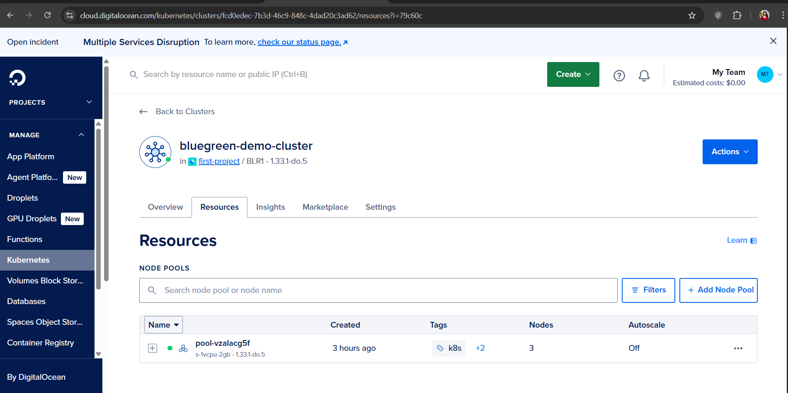
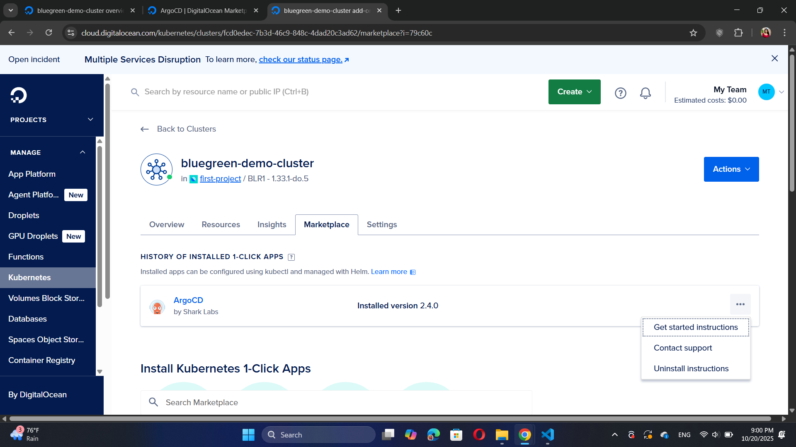
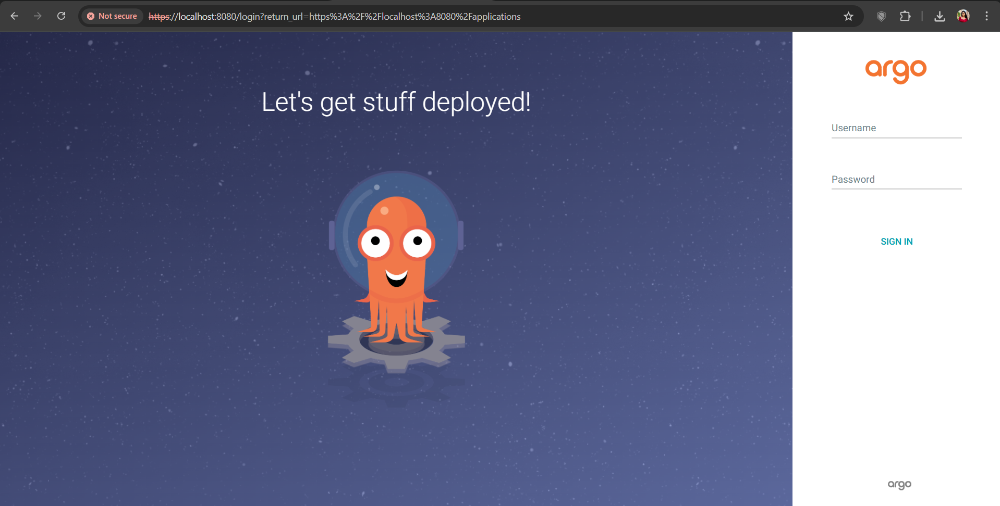
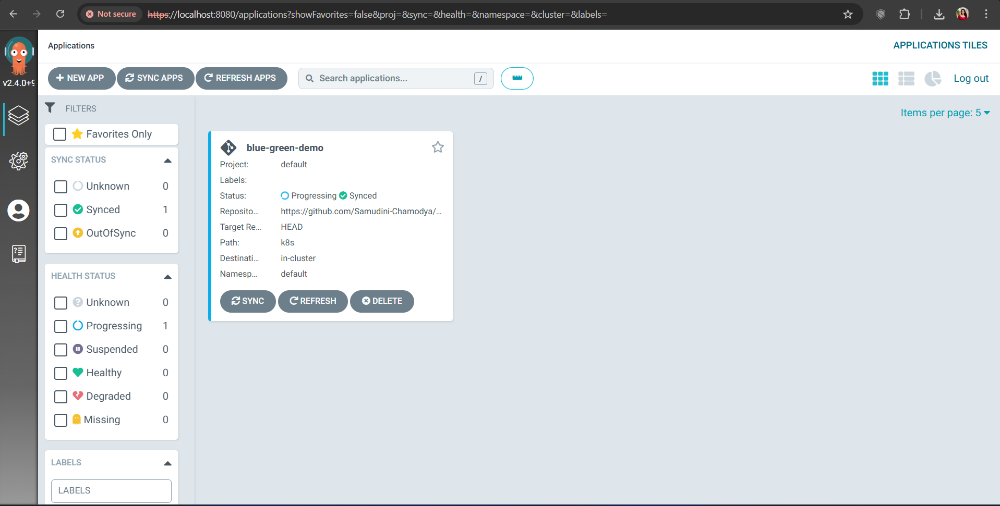
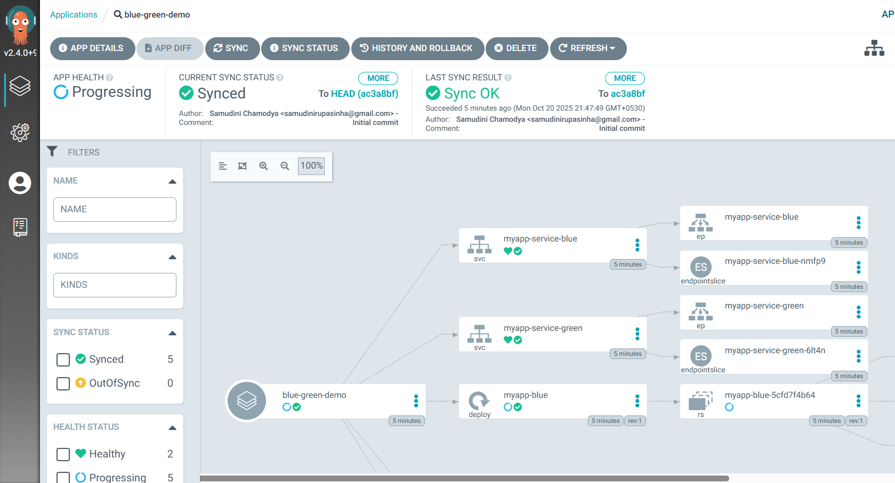
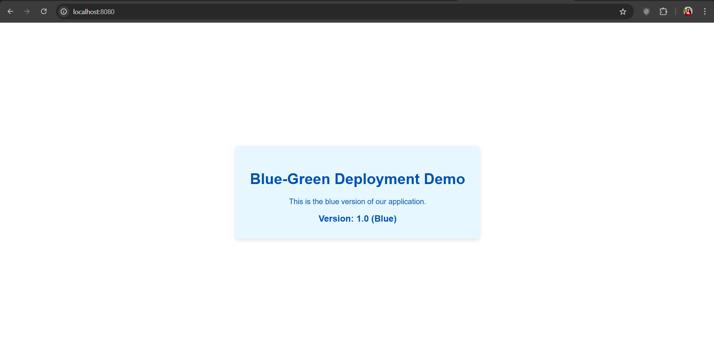
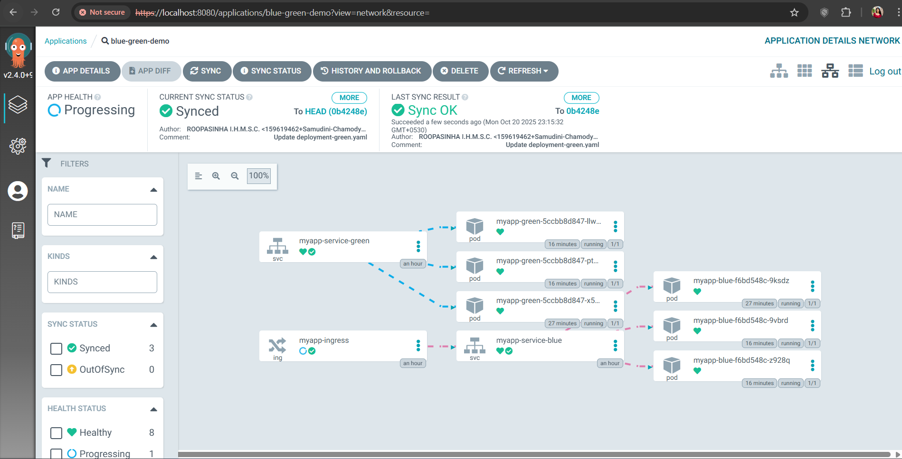
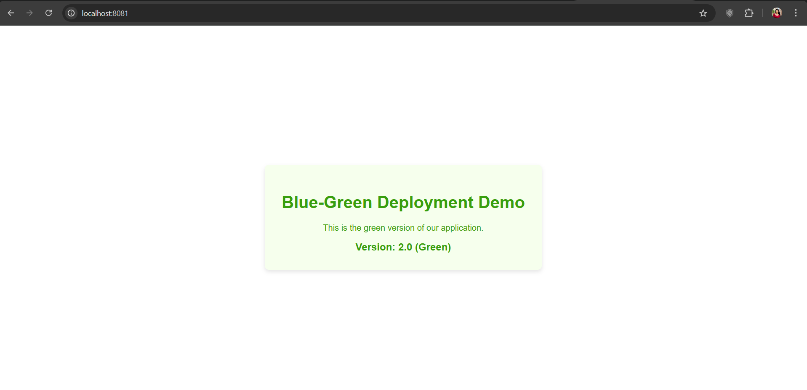

# 🌈 Blue-Green Deployment with ArgoCD on DigitalOcean

A complete beginner-friendly guide to implementing **Blue-Green deployment strategy** using ArgoCD on DigitalOcean Kubernetes. Deploy applications with zero downtime and instant rollback capabilities!

## 📋 Table of Contents

- [What is Blue-Green Deployment?](#what-is-blue-green-deployment)
- [Features](#features)
- [Prerequisites](#prerequisites)
- [Architecture Overview](#architecture-overview)
- [Quick Start](#quick-start)
- [Detailed Setup Guide](#detailed-setup-guide)
- [Usage](#usage)
- [Switching Versions](#switching-versions)
- [Troubleshooting](#troubleshooting)
- [Cost Estimation](#cost-estimation)
- [Contributing](#contributing)
- [License](#license)

## 🎯 What is Blue-Green Deployment?

Blue-Green deployment is a release management strategy that reduces downtime and risk by running two identical production environments called **Blue** and **Green**. At any time, only one environment is live, serving production traffic. This allows you to:

- ✅ Deploy new versions with **zero downtime**
- ✅ Perform **instant rollbacks** if issues occur
- ✅ Test in production-like environment
- ✅ Reduce deployment risk

## ✨ Features

- 🚀 **Zero-downtime deployments** - Switch between versions instantly
- 🔄 **Instant rollback** - Revert to previous version in seconds
- 📦 **GitOps workflow** - All changes tracked in Git
- 🎨 **Visual management** - Beautiful ArgoCD dashboard
- 🔐 **Production-ready** - Battle-tested deployment strategy
- 💰 **Cost-effective** - Use DigitalOcean's $200 free credits

## 📦 Prerequisites

Before you begin, ensure you have:

- ✅ DigitalOcean account
- ✅ GitHub account
- ✅ Basic understanding of Kubernetes concepts
- ✅ `kubectl` installed on your local machine (optional)
- ✅ Git installed

**Estimated Setup Time**: 30-45 minutes

## 🏗️ Architecture Overview

```
┌─────────────────────────────────────────────────────────┐
│                    GitHub Repository                     │
│  (Blue App Manifests)    (Green App Manifests)          │
└────────────┬────────────────────────┬───────────────────┘
             │                        │
             │   GitOps Sync         │
             ▼                        ▼
┌─────────────────────────────────────────────────────────┐
│                      ArgoCD                              │
│         (Continuous Deployment Controller)               │
└────────────┬────────────────────────┬───────────────────┘
             │                        │
             ▼                        ▼
┌──────────────────┐      ┌──────────────────┐
│   Blue Pods      │      │   Green Pods     │
│   (Version 1.0)  │      │   (Version 2.0)  │
└──────────────────┘      └──────────────────┘
         │                         │
         └────────┬────────────────┘
                  │
                  ▼
         ┌────────────────┐
         │   Production   │
         │ Load Balancer  │ ◄─── Traffic switching point
         └────────────────┘
                  │
                  ▼
            👥 Users
```


## 🚀 Quick Start

### 1. Clone This Repository

```bash
git clone https://github.com/YOUR-USERNAME/Blue-Green-Deployment-With-Digitalocean.git
cd Blue-Green-Deployment-With-Digitalocean
```

### 2. Fork the Application Repositories

- Fork `blue-app-demo` repository
- Fork `green-app-demo` repository
- Fork `production-service` repository

### 3. Create DigitalOcean Kubernetes Cluster




**Configuration**:
- Kubernetes Version: **1.31.x**
- Datacenter: Choose closest region
- Node Size: **2 GB RAM / 1 vCPU** ($12/month)
- Node Count: **2 nodes**
- Cluster Name: `bluegreen-demo`

### 4. Install ArgoCD




1. Navigate to **Marketplace** tab in your cluster
2. Search for "ArgoCD"
3. Click **Install App**
4. Wait 2-3 minutes for installation

### 5. Access ArgoCD Dashboard




1. Go to **Networking** tab
2. Find ArgoCD Server LoadBalancer IP
3. Open `http://[EXTERNAL-IP]` in browser
4. Login with:
   - **Username**: `admin`
   - **Password**: Get from `argocd-initial-admin-secret`

## 📖 Detailed Setup Guide

### Phase 1: Deploy Blue Application

#### Step 1: Create Blue Application in ArgoCD




Click **+ NEW APP** and configure:

**General Settings**:
- Application Name: `blue-app`
- Project: `default`
- Sync Policy: `Manual`

**Source**:
- Repository URL: `https://github.com/YOUR-USERNAME/blue-app-demo`
- Revision: `HEAD`
- Path: `.`

**Destination**:
- Cluster URL: `https://kubernetes.default.svc`
- Namespace: `default`

#### Step 2: Sync Blue Application




1. Click on `blue-app` tile
2. Click **SYNC** button
3. Click **SYNCHRONIZE**
4. Watch real-time deployment

#### Step 3: Access Blue Version




1. Go to **Networking → Load Balancers**
2. Find `blue-service` LoadBalancer
3. Copy External IP
4. Open `http://[BLUE-IP]` in browser

**Expected Result**: 🔵 BLUE VERSION - v1.0

### Phase 2: Deploy Green Application

Repeat the same process for Green application:




- Application Name: `green-app`
- Repository: `https://github.com/YOUR-USERNAME/green-app-demo`

**Expected Result**: 🟢 GREEN VERSION - v2.0




### Phase 3: Create Production Service

#### Deploy Traffic Controller

Create production service that routes traffic to either Blue or Green:

```yaml
apiVersion: v1
kind: Service
metadata:
  name: production
spec:
  type: LoadBalancer
  selector:
    app: demo
    version: blue  # Change this to switch versions!
  ports:
    - port: 80
      targetPort: 80
```

## 🔄 Switching Versions

### Method 1: GitOps Way (Recommended)

```bash
# Edit production-service/service.yaml
# Change: version: blue → version: green

git add service.yaml
git commit -m "Switch to green version"
git push

# In ArgoCD: REFRESH → SYNC
```

### Method 2: ArgoCD UI

1. Click `production-service` app
2. Find Service resource → **EDIT**
3. Change `version: blue` to `version: green`
4. **SAVE**


## 🔙 Instant Rollback

If issues occur in Green version:

```bash
# Change back to blue
version: green → version: blue

# Commit and sync
git add . && git commit -m "Rollback to blue" && git push
```

Traffic instantly returns to Blue! ⚡


### Production Service (`production-service/service.yaml`)

```yaml
apiVersion: v1
kind: Service
metadata:
  name: production
  namespace: default
  labels:
    app: production
spec:
  type: LoadBalancer
  selector:
    app: demo
    version: blue  # 👈 CHANGE THIS TO SWITCH VERSIONS!
  ports:
    - name: http
      port: 80
      targetPort: 80
      protocol: TCP
```

##  Troubleshooting

### App Not Syncing?

**Solutions**:
- Check repository URL is correct
- Verify repository is public or SSH keys are configured
- Check **APP DETAILS** → **EVENTS** for error messages
- Ensure YAML files have correct syntax

### LoadBalancer IP Not Assigned?

**Solutions**:
- Wait 2-3 minutes for provisioning
- Check DigitalOcean account is verified
- Verify cluster has internet connectivity
- Check **Networking** tab for firewall rules

### Pods Not Starting?

**Solutions**:
1. Go to **Workloads** → **Pods**
2. Click failing pod → **Logs**
3. Common issues:
   - Wrong container port
   - Image pull errors
   - Resource limits exceeded

### Service Not Routing Traffic?

**Check**:
- Selector labels match pod labels exactly
- Pods are in `Running` state
- Service type is `LoadBalancer`
- External IP is assigned
